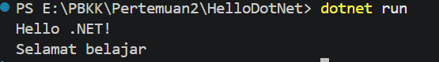
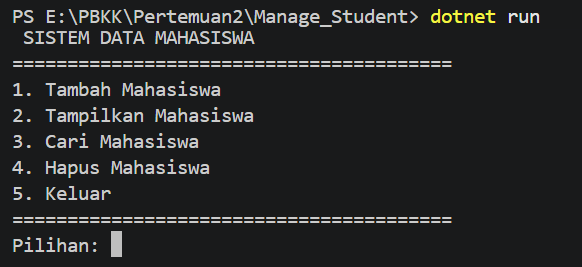
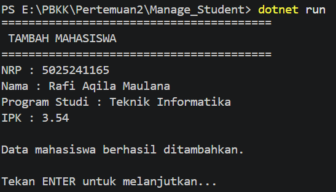
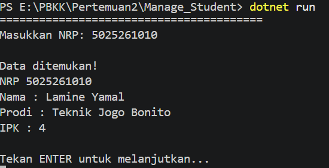
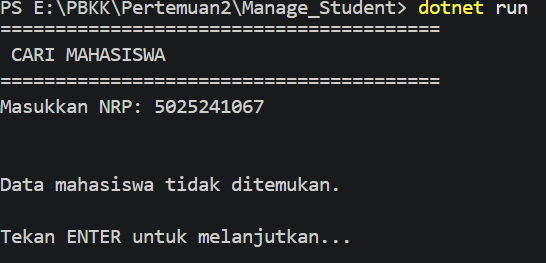
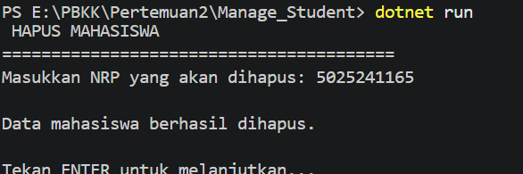
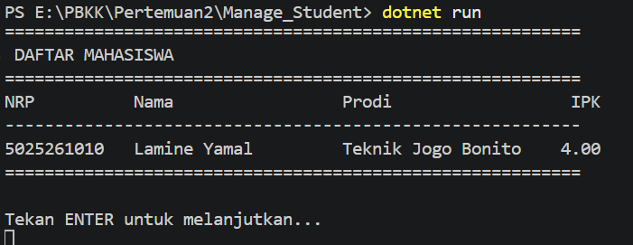

# Dokumentasi Pertemuan 2

## HelloDotNet
Proyek ini merupakan aplikasi perkenalan dasar menggunakan platform .NET. Aplikasi ini dibuat untuk menunjukkan struktur awal proyek .NET dan bagaimana program sederhana dijalankan.

Aplikasi ini melakukan eksekusi sederhana berikut:

### 1. Menampilkan Pesan Konsol
Program akan mencetak teks sapaan "Hello .NET!" dan "Selamat belajar " ke layar ketika dijalankan.

---

## Manage_Student
Proyek ini adalah aplikasi konsol sederhana yang berfokus pada pengelolaan data. Aplikasi ini berfungsi untuk mensimulasikan pencatatan dan pengelolaan informasi terkait data mahasiswa secara terstruktur.

Aplikasi ini memiliki beberapa fitur yang dapat dijalankan, yaitu:

### 1. Menu Utama
Menampilkan daftar pilihan menu aksi yang bisa dipilih oleh pengguna saat aplikasi baru berjalan.

### 2. Tambah Mahasiswa
Meminta pengguna untuk memasukkan data mahasiswa (NRP, Nama, Prodi, IPK) dan menyimpannya ke dalam sistem.

### 3. Tampilkan Mahasiswa
Menampilkan seluruh data mahasiswa yang telah tersimpan dalam format tabel.
)

### 4. Cari Mahasiswa
Mencari data mahasiswa berdasarkan NRP dan menampilkan detail informasinya jika ditemukan.

### 5. Hapus Mahasiswa
Mencari data mahasiswa berdasarkan NRP dan menghapusnya dari sistem jika data tersebut ada.

