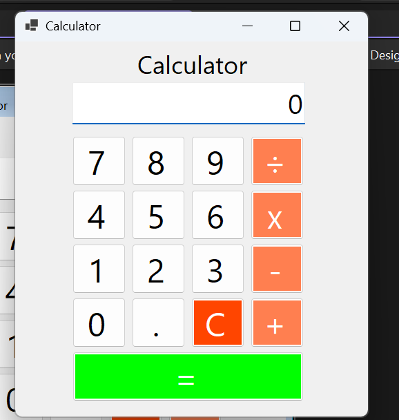
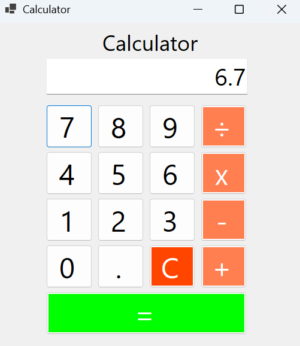

# Dokumentasi Pertemuan 3

## CalculatorApp
Project ini merupakan aplikasi kalkulator yang dibuat dengan menggunakan Windows Forms (.NET framework). Aplikasi ini dibuat untuk melakukan operasi aritmatika dasar, dilengkapi dengan tombol angka, tombol operator, tombol titik desimal, fitur reset, serta penanganan kesalahan (*error handling*).

Aplikasi ini memiliki beberapa fitur dan alur kerja yang dapat dijalankan, yaitu:

### 1. Tampilan Utama Kalkulator
Menampilkan antarmuka kalkulator saat pertama kali dijalankan dengan layar *display* berangka awal "0", susunan tombol digit angka (0–9), tombol operasi aritmatika (+, −, ×, ÷), tombol titik desimal (.), tombol *Clear* (C), dan tombol sama dengan (=).

### 2. Input Angka dan Desimal
Memungkinkan pengguna memasukkan kombinasi angka. Terdapat pula tombol titik desimal (.) untuk menginput angka pecahan dengan validasi otomatis agar tanda desimal tidak dapat dimasukkan berulang kali pada angka yang sama.

### 3. Operasi Penjumlahan (+)
Melakukan perhitungan penjumlahan antara dua bilangan ketika pengguna menekan tombol operator tambah (+) dan menekan tombol sama dengan (=) untuk menampilkan hasilnya.

https://github.com/user-attachments/assets/c963fdcb-270d-41b2-8105-069730549e83

### 4. Operasi Pengurangan (−)
Melakukan operasi pengurangan antara bilangan pertama dan bilangan kedua yang kemudian hasilnya langsung ditampilkan pada layar *display*.

https://github.com/user-attachments/assets/f2d3221f-29bf-41c0-a45d-7552cc025f98

### 5. Operasi Perkalian (×)
Melakukan perhitungan perkalian antara dua bilangan dan menampilkan hasil kalkulasi secara akurat.

https://github.com/user-attachments/assets/22c1c958-cf75-4029-b203-30184aef7e10

### 6. Operasi Pembagian (÷)
Melakukan pembagian bilangan pertama terhadap bilangan kedua dan menampilkan nilai hasilnya pada layar.

https://github.com/user-attachments/assets/6f244b87-780e-43bc-92de-5e3cdbf051fd

### 7. Penanganan Error Pembagian Nol (*Divide by Zero*)
Sistem dilengkapi dengan penanganan eksepsi (*try-catch*). Jika pengguna mencoba membagi suatu bilangan dengan angka nol (0), aplikasi akan menangkap `DivideByZeroException` dan menampilkan kotak dialog pesan error (*MessageBox*) tanpa membuat aplikasi keluar/crash.

https://github.com/user-attachments/assets/ef8838f8-4e5b-435a-8ff1-420defb50621

### 8. Fitur Reset / Clear (C)
Mengembalikan kalkulator ke kondisi awal dengan mereset seluruh variabel hitung (*firstNumber*, *secondNumber*, *result*, dan jenis operasi) serta mengembalikan tampilan layar *display* ke nilai "0".

https://github.com/user-attachments/assets/1ea50b17-9ef2-4c8e-8cda-ff4d24395a12

### Refleksi Mahasiswa:

1. Apa fungsi object sender pada event handler?
Parameter object sender merepresentasikan kontrol antarmuka (dalam hal ini, sebuah Button) yang memicu atau memanggil event tersebut. Pada kode kalkulator, sender memungkinkan aplikasi mengidentifikasi secara spesifik tombol mana yang sedang diklik oleh pengguna dengan melakukan casting objek menjadi (Button)sender.

2. Mengapa semua tombol angka dapat memakai satu NumberButton_Click?
Semua tombol angka memiliki logika yang identik, yaitu menambahkan teks (angka) dari tombol tersebut ke dalam layar tampilan txtDisplay. Dengan menggunakan object sender untuk mengekstrak nilai teks (0-9) dari tombol yang memicu event, Anda menghindari penulisan ulang kode yang sama untuk 10 tombol berbeda.

3. Apa perbedaan firstNumber, secondNumber, dan result?
firstNumber: Menyimpan angka pertama yang dimasukkan oleh pengguna sebelum menekan tombol operator.
secondNumber: Menyimpan angka kedua yang diekstrak dari layar saat tombol sama dengan (=) ditekan.
result: Menyimpan hasil kalkulasi aritmatika antara firstNumber dan secondNumber berdasarkan operator yang dipilih.

4. Mengapa pembagian dengan nol perlu divalidasi?
Dalam pemrograman C#, operasi pembagian dengan nilai nol tidak terdefinisi dan secara otomatis akan memicu runtime error yang disebut DivideByZeroException. Jika tidak divalidasi dengan melempar exception atau memberikan peringatan, operasi ini akan membuat aplikasi mengalami kegagalan sistem (crash).

5. Bagaimana try-catch membantu menjaga aplikasi tetap stabil?
Blok try-catch melindungi aplikasi dari crash saat terjadi kesalahan fatal (seperti pembagian dengan nol atau format input yang salah) selama eksekusi di blok try. Alih-alih aplikasi tertutup paksa, blok catch akan menangkap exception tersebut dan menginstruksikan program untuk tetap berjalan sembari menampilkan pesan kesalahan (error message) kepada pengguna melalui MessageBox.
