# Dokumentasi Pertemuan 4

## EmployeeRegistrationApp

Project ini merupakan aplikasi pendaftaran pegawai yang dibuat menggunakan **Windows Presentation Foundation (WPF)** dengan .NET. Aplikasi ini memungkinkan pengguna untuk mendaftarkan data pegawai baru, menampilkan daftar pegawai yang telah didaftarkan, mencari pegawai secara real-time, serta menghapus data pegawai dari daftar. Aplikasi dilengkapi dengan validasi input yang komprehensif, deteksi data duplikat, fitur pencarian dinamis, serta dialog konfirmasi sebelum penghapusan data.

Aplikasi ini memiliki beberapa fitur dan alur kerja yang dapat dijalankan, yaitu:

---

### 1. Tampilan Utama Aplikasi
Menampilkan antarmuka pendaftaran pegawai saat pertama kali dijalankan. Terdiri dari dua panel utama: panel kiri berisi form input (NIK, Nama, Departemen, Jenis Kelamin, dan tombol aksi) dan panel kanan berisi daftar pegawai yang telah didaftarkan (`ListBox`).

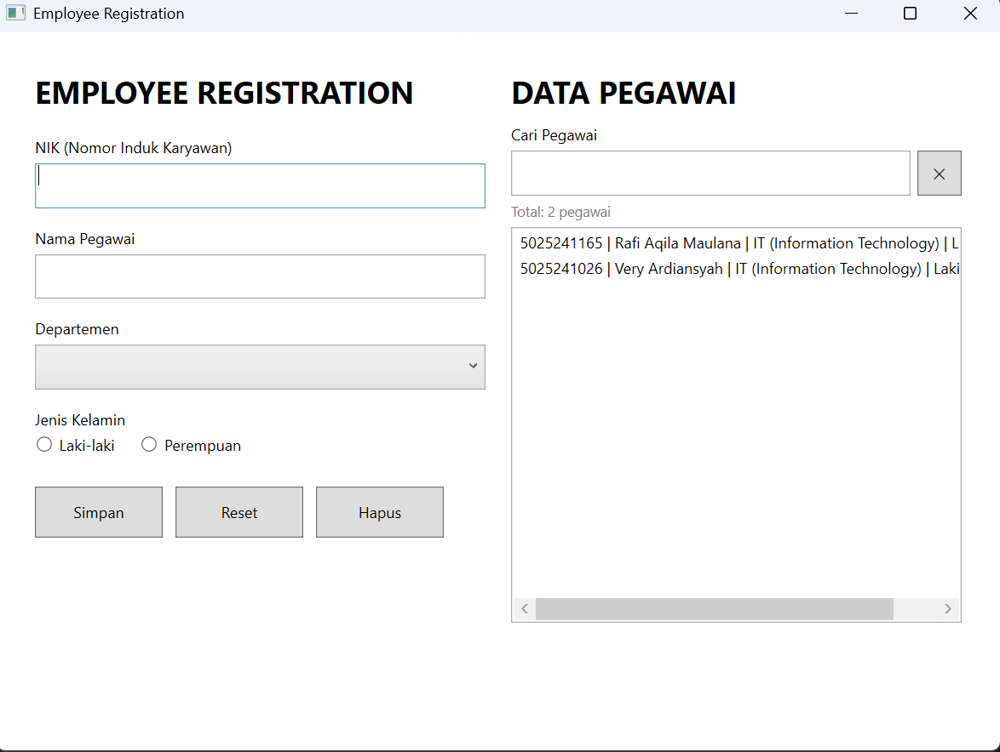

---

### 2. Validasi Input — NIK

Sistem melakukan validasi bertingkat terhadap field NIK:
- **NIK tidak boleh kosong** — menampilkan peringatan dan memindahkan fokus ke field NIK.
- **Panjang NIK** harus antara 5 hingga 20 karakter.
- **NIK hanya boleh berisi angka** — karakter non-digit akan ditolak.

Jika validasi gagal, `MessageBox` dengan ikon peringatan (*Warning*) akan ditampilkan.

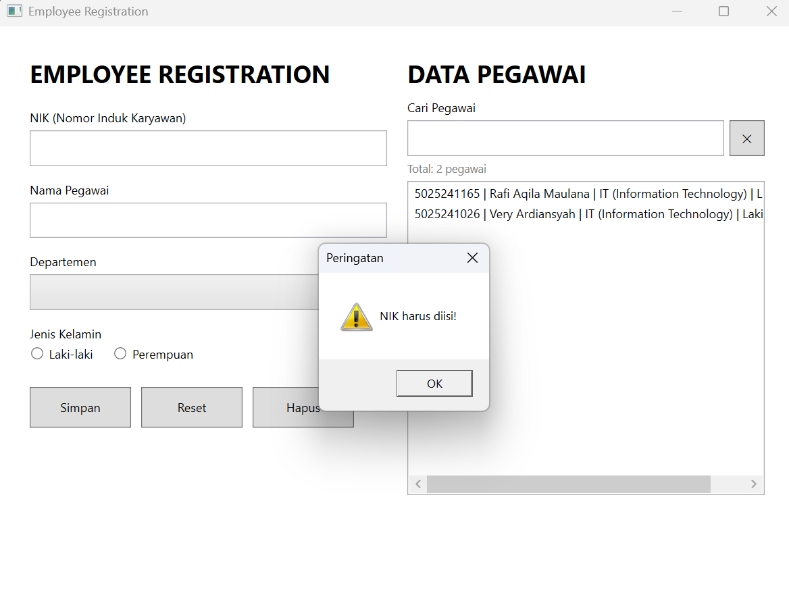
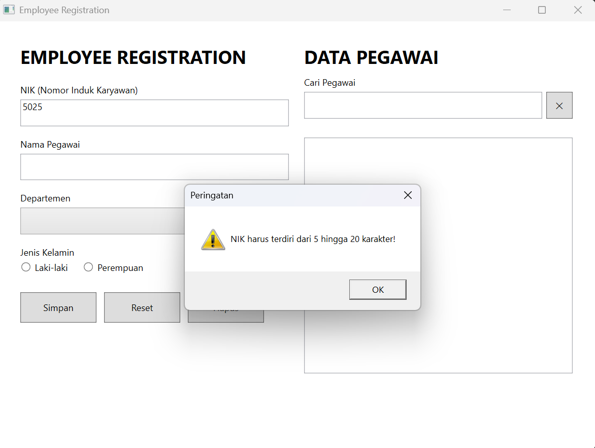
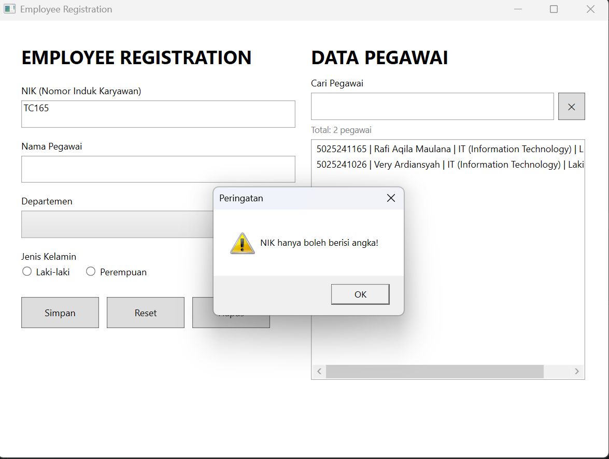

---

### 3. Validasi Input — Nama

Sistem melakukan validasi terhadap field Nama Pegawai:
- **Nama tidak boleh kosong**.
- **Nama minimal 3 karakter** — input yang terlalu pendek akan ditolak.

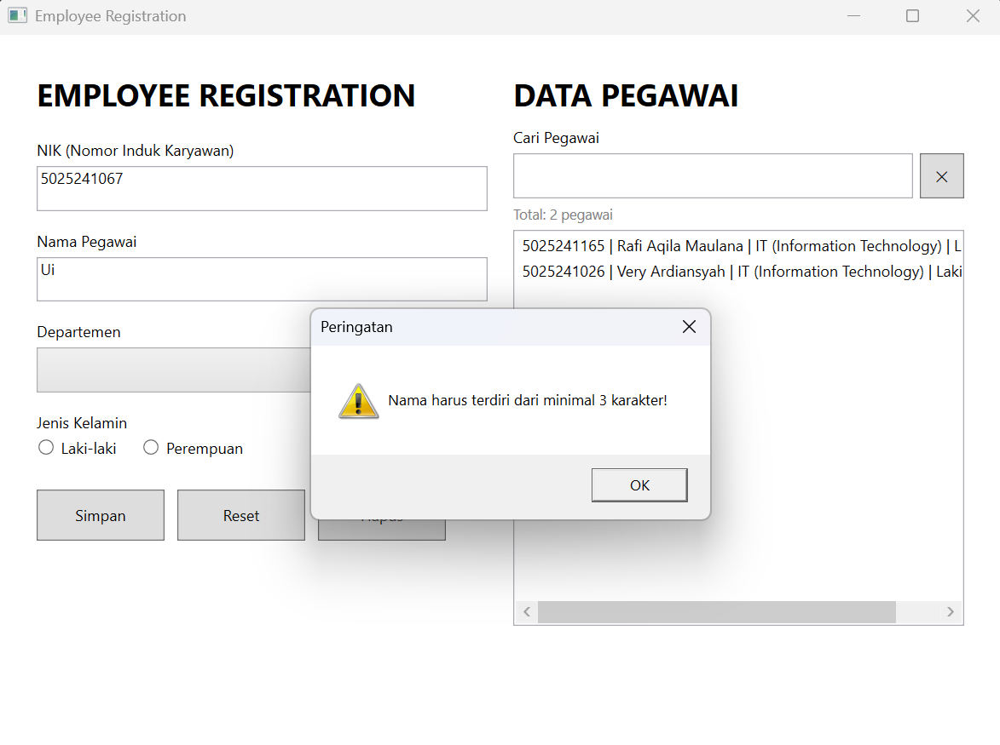

---

### 4. Validasi Input — Departemen & Jenis Kelamin

Sistem memvalidasi bahwa:
- **Departemen** harus dipilih dari `ComboBox` (IT, HR, Finance, atau Marketing).
- **Jenis Kelamin** harus dipilih salah satu dari `RadioButton` (Laki-laki atau Perempuan).

Jika salah satu belum dipilih, pesan peringatan akan ditampilkan sesuai field yang belum terisi.

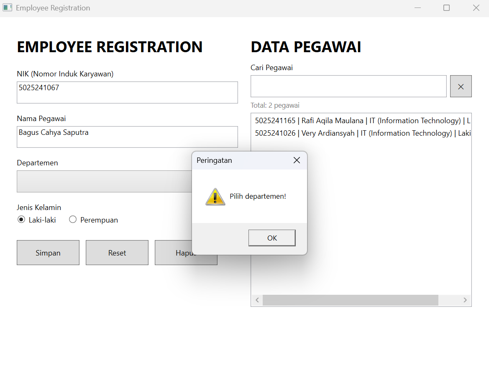

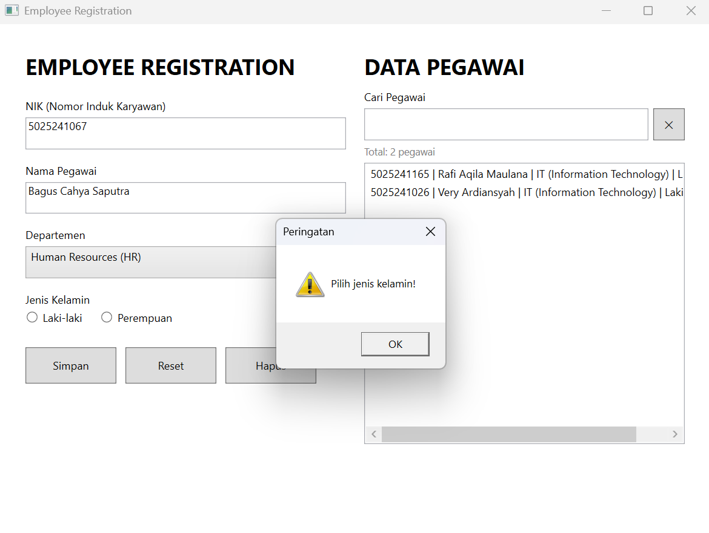

---

### 5. Deteksi NIK Duplikat

Sebelum menyimpan data, sistem memeriksa seluruh data yang sudah ada di `ListBox`. Jika NIK yang dimasukkan sudah terdaftar sebelumnya, sistem akan menolak penyimpanan dan menampilkan peringatan beserta NIK yang bentrok, tanpa menambahkan data duplikat ke dalam daftar.

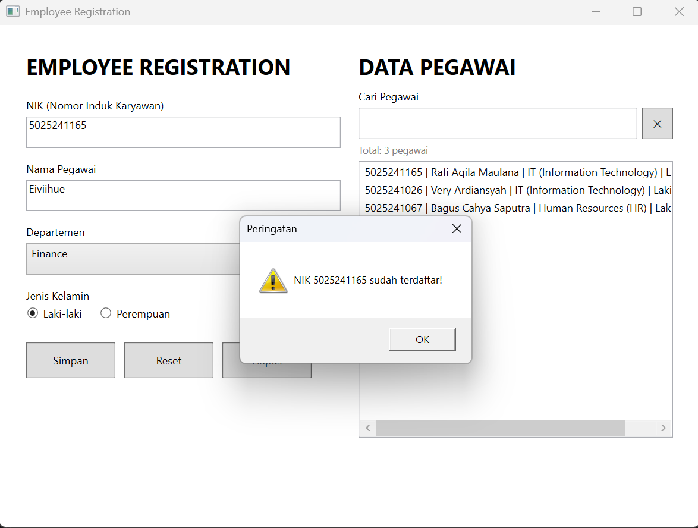

---

### 6. Simpan Data Pegawai

Setelah semua validasi berhasil dilewati, data pegawai (NIK, Nama, Departemen, Jenis Kelamin) disimpan ke dalam `ListBox` dalam format:
```
NIK | Nama | Departemen | Jenis Kelamin
```
Sebuah `MessageBox` ringkasan akan ditampilkan yang memuat seluruh detail data yang baru saja disimpan. Form kemudian direset secara otomatis agar siap menerima input berikutnya.

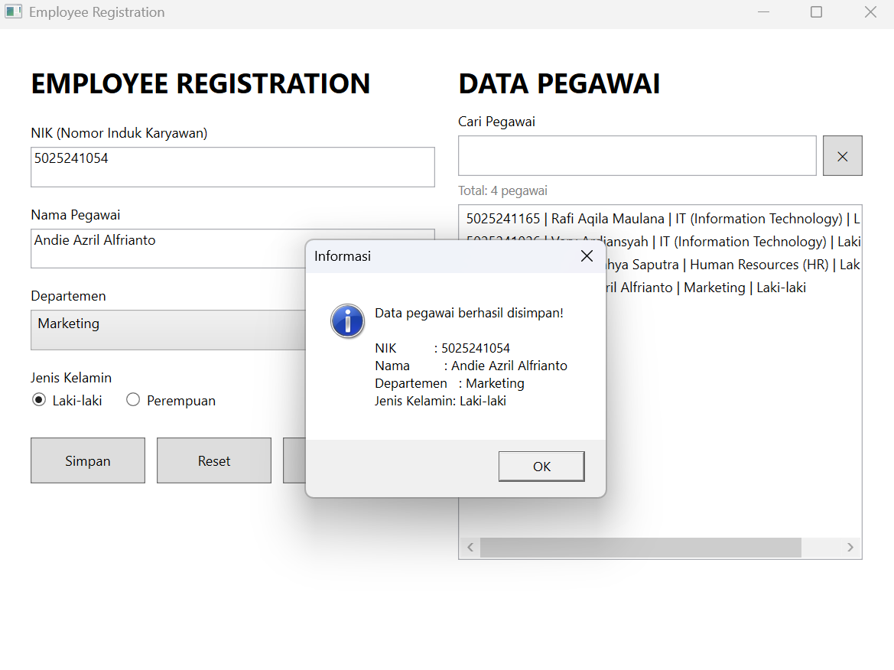

---

### 7. Hapus Data dengan Konfirmasi

Tombol **Hapus** menghapus data pegawai yang dipilih dari `ListBox`. Sebelum penghapusan dilakukan, sistem menampilkan dialog konfirmasi (*YesNo*) yang menampilkan data yang akan dihapus. Data hanya dihapus dari *backing list* dan tampilan `ListBox` jika pengguna memilih **Yes**. Jika tidak ada data yang dipilih, pesan peringatan akan ditampilkan.

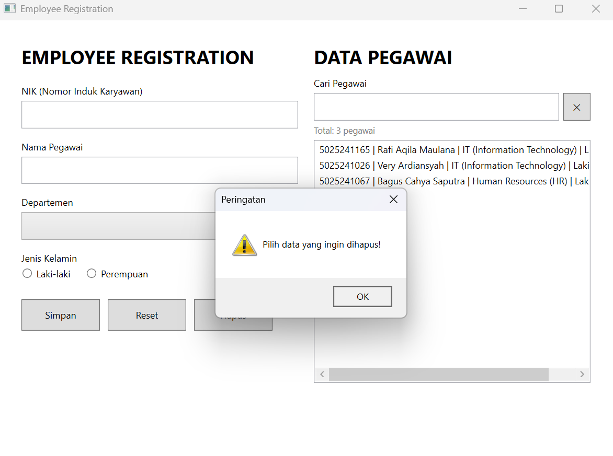
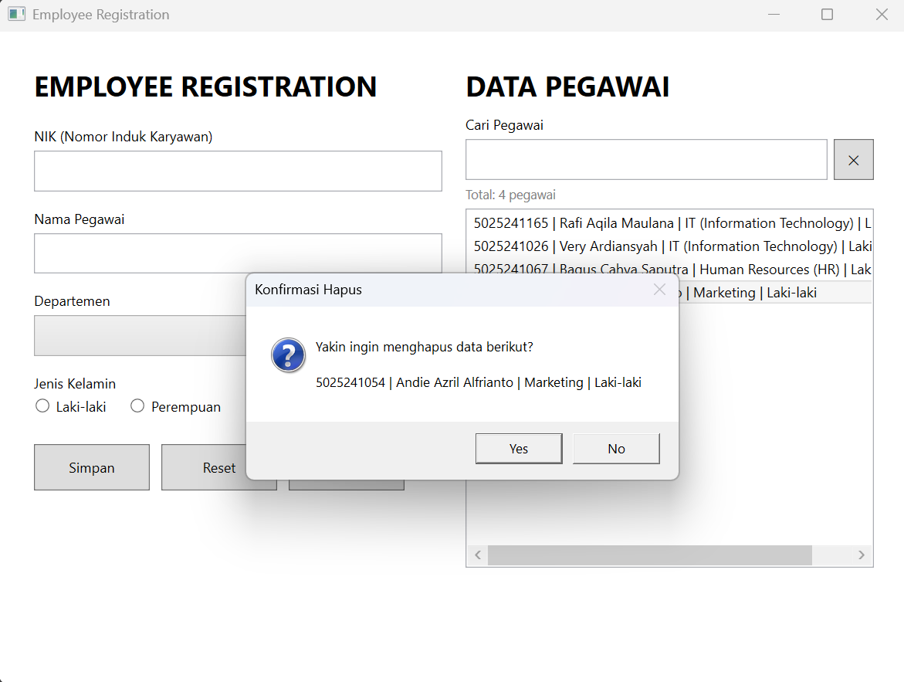
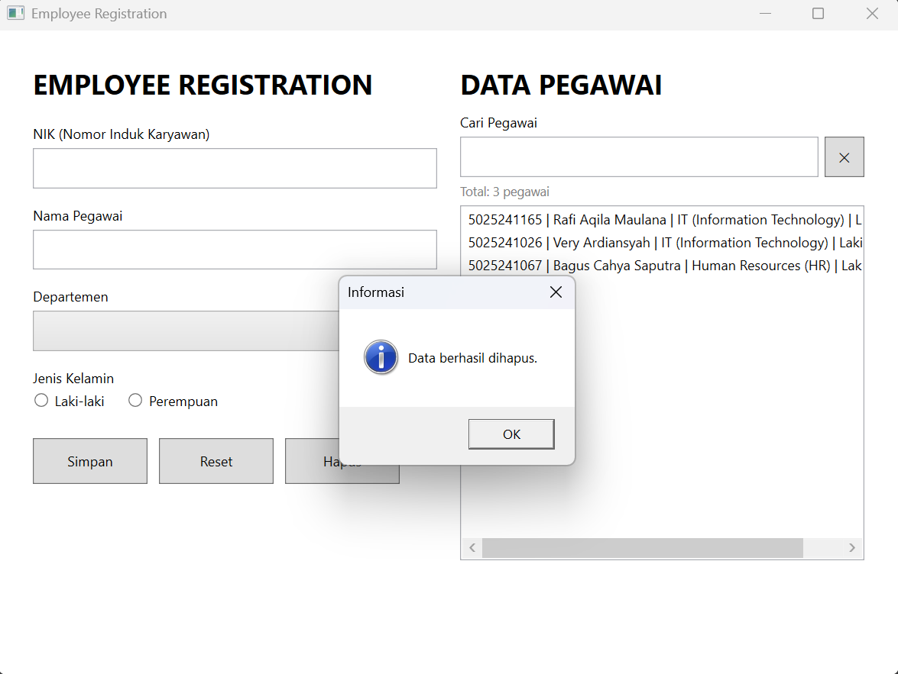

---

### 8. Pencarian Pegawai (*Search*)

Panel **DATA PEGAWAI** dilengkapi dengan kotak pencarian di bagian atas `ListBox`. Pencarian bersifat **real-time** — `ListBox` langsung difilter setiap kali pengguna mengetik karakter baru pada `TextBox` pencarian (event `TextChanged`). Pencarian bersifat *case-insensitive* dan mencakup seluruh kolom data (NIK, Nama, Departemen, maupun Jenis Kelamin).

Label **counter** di bawah kotak pencarian menampilkan:
- `Total: N pegawai` — saat tidak ada kata kunci aktif.
- `Ditemukan: X dari N pegawai` — saat kata kunci cocok dengan sebagian data.
- `Tidak ada pegawai yang cocok dengan "..."` — saat tidak ada data yang sesuai.

Tombol **✕** di samping kotak pencarian digunakan untuk membersihkan kata kunci dan menampilkan kembali seluruh data.

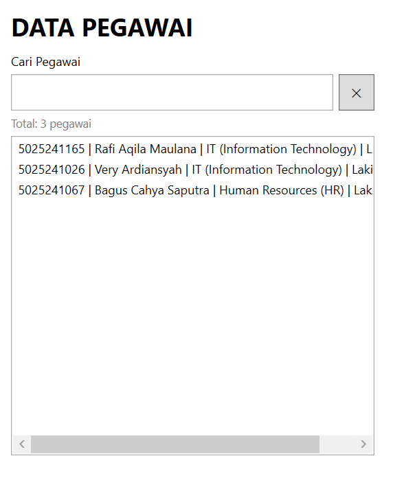

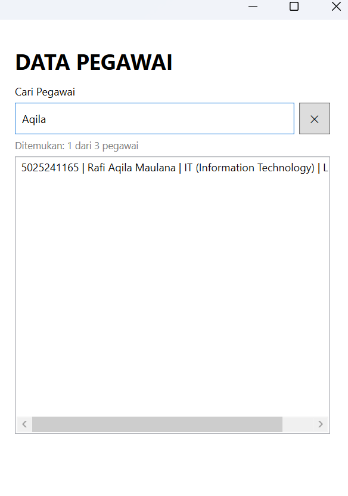

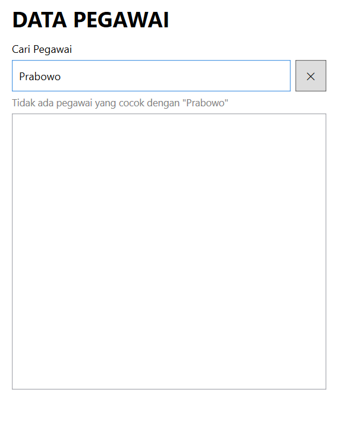